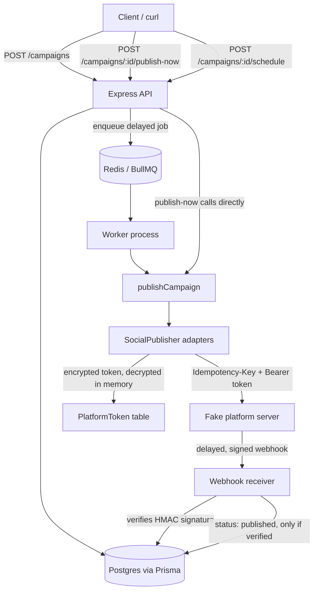

# Multi-Platform Social Campaign Publisher

Turns one published blog post into a scheduled social campaign: the right image variant and caption per platform, published through a system that survives duplicate requests, rate limits, and crashed workers without ever double-posting or trusting an unverified status update.

Everything runs against a fake social platform server built for this project no real Instagram/X accounts are ever touched.

FlyRank Backend AI Engineering Internship  Capstone Project.

## Status

All 4 build phases complete: Design → Content generation → Publishing system → Production reliability. See `EVIDENCE.md` for proof of every Definition-of-Done item and `BUILDLOG.md` for an honest log of where AI helped, where it was wrong, and what got caught and fixed along the way.

## Architecture



**Layers, bottom to top:**

- **Data layer** — PostgreSQL via Prisma. `Campaign`, `SocialPostEntry`, `PlatformToken`, `WebhookEvent`.
- **Adapter layer** — the `SocialPublisher` interface, with `FakeInstagramPublisher` and `FakeXPublisher` as its two       implementations. Nothing above this layer knows which platform it's  talking to.
- **Service layer** — `publishCampaign()` is the single source of trut for "publish every post in a campaign," used identically by the immediate endpoint and the scheduled worker.
- **HTTP layer** — Express routes for campaigns, scheduling, and the webhook receiver.
- **Fake platform server** — a separate process simulating Instagram/X: issues OAuth tokens, honors `Idempotency-Key`, can be told to return a 429 on demand, and confirms delivery asynchronously via a signed webhook  the same shape a real platform's API actually behaves.

## Stack

- Node.js + Express + TypeScript
- PostgreSQL via Prisma (Docker)
- Redis + BullMQ for durable scheduling (Docker)
- `sharp` for image variants
- AES-256-GCM (Node's built-in `crypto`) for token-at-rest encryption
- Vitest for automated tests

## Setup

```bash
# 1. Install dependencies
npm install

# 2. Start Postgres + Redis
docker compose up -d

# 3. Configure environment
cp .env.example .env
# then fill in TOKEN_ENCRYPTION_KEY — generate your own:
node -e "console.log(require('crypto').randomBytes(32).toString('base64'))"

# 4. Create the database schema
npx prisma migrate dev

# 5. Run the tests
npm test
```

## Running it

This system is three separate processes, matching how it would actually be deployed: a web server, a background worker, and (for local development only) the fake platform standing in for a real one:

```bash
npm run dev            # the main API, port 3000
npm run fake-platform   # the fake Instagram/X stand-in, port 4000
npm run worker          # picks up scheduled campaigns from Redis
```

All three need to be running for the full scheduled-publish flow to work. `publish-now` only needs the main app and the fake platform.

## API

```
POST   /campaigns                      create a campaign (generates image
                                        variants + platform-aware captions)
GET    /campaigns/:id                  view a campaign and its posts
POST   /campaigns/:id/publish-now      publish immediately, through the
                                        real adapter layer
POST   /campaigns/:id/schedule         schedule for a future time
                                        { "scheduledFor": "<ISO 8601>" }
POST   /webhook/social-delivery        receives signed delivery
                                        confirmations from the fake platform
GET    /health                        confirms the database connection
```

## Demo script

This walks through every acceptance probe end to end. Run each `curl` in order, with `npm run dev` and `npm run fake-platform` both running.

**1. Create a campaign** (generates real image variants + distinct
platform captions):

```bash
curl -X POST http://localhost:3000/campaigns \
  -H "Content-Type: application/json" \
  -d '{"blogPostId":"demo-1","title":"Demo Post","body":"Proving this actually works."}'
```

Copy the returned campaign `id` for the next steps.

**2. Publish it, and hammer it again** (idempotency — should return the identical `externalPostId` both times, `deduplicated: true` on the second call):

```bash
curl -X POST http://localhost:3000/campaigns/<id>/publish-now
curl -X POST http://localhost:3000/campaigns/<id>/publish-now
```

**3. Check the encrypted token at rest** (never plaintext):

```bash
docker exec -it flyrank-capstone-socialstudio-postgres-1 psql -U socialstudio -d socialstudio \
  -c 'SELECT platform, "encryptedAccessToken" FROM "PlatformToken";'
```

**4. Trigger a rate limit on purpose**, and watch it back off and succeed rather than fail:

```bash
curl -X POST http://localhost:3000/campaigns/<id>/publish-now \
  -H "Content-Type: application/json" -d '{"simulateRateLimit": true}'
```

**5. Send a forged webhook** — should be rejected with 400, and the
real data left untouched:

```bash
curl -i -X POST http://localhost:3000/webhook/social-delivery \
  -H "Content-Type: application/json" \
  -H "X-Signature: 0000000000000000000000000000000000000000000000000000000000000000" \
  -d '{"socialPostEntryId":"<a-real-post-id>","externalPostId":"forged","status":"published"}'
```

**6. Schedule one for 15 seconds out, with no worker running**, then
start the worker and watch it recover the overdue job:

```bash
curl -X POST http://localhost:3000/campaigns/<id>/schedule \
  -H "Content-Type: application/json" \
  -d "{\"scheduledFor\":\"$(date -u -d '+15 seconds' +%Y-%m-%dT%H:%M:%S.000Z)\"}"

# wait 20+ seconds, then:
npm run worker
```

## Testing

```bash
npm test
```

18 tests across 5 files: image dimensions, platform-aware captions, token encryption round-trip, webhook signature verification (valid, forged, tampered, wrong secret), and rate-limit retry/backoff. See `EVIDENCE.md` for the one deliberate gap (duplicate-publish is proven live, not by an automated test) and why.

## Known limitations

- The fake platform server's idempotency-key store is in-memory itforgets everything on restart. A real platform wouldn't. This only affects local testing, never the real system's own durability guarantees (those live in Postgres and Redis, both of which persist).
- Only 2 platforms are implemented (Instagram, X) — adding a third meanswriting one more `SocialPublisher` subclass, not touching anything else.
- Source images are always a generated placeholder — the brief explicitly scopes grading to the variant pipeline, not image sourcing.

## Further reading

- `DESIGN.md` — the original design doc (data model, API surface, layersketch) written before any code
- `EVIDENCE.md` — pasted proof for every Definition-of-Done item
- `BUILDLOG.md` — an honest log of AI's role in building this, including every real bug that came up and how it was caught
